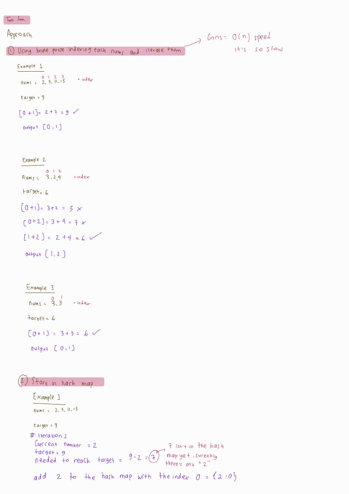
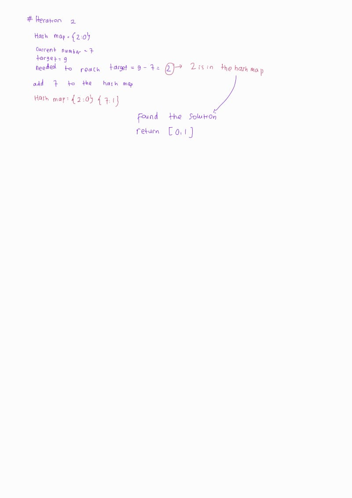

## Problem: Two Sum (LeetCode)

### A. Problem Statement 💁‍♀️
Given an array of integers `nums` and an integer `target`, return the indices of the two numbers such that they add up to `target`.


You may assume that each input would have exactly one solution, and you may not use the same element twice.

You can return the answer in any order.

### B. Problem Examples 😌
#### ✨ Example 1:
Input: nums = [2,7,11,15], target = 9
Output: [0,1]
Explanation: Because nums[0] + nums[1] == 9, we return [0, 1].

#### ✨ Example 2:
Input: nums = [3,2,4], target = 6
Output: [1,2]
Example 3:

Input: nums = [3,3], target = 6
Output: [0,1]
 
### C. Problem Constraints 🫡

2 <= nums.length <= 104 </br>
-109 <= nums[i] <= 109 </br>
-109 <= target <= 109 </br>
Only one valid answer exists. </br>
 

Follow-up: Can you come up with an algorithm that is less than O(n2) time complexity?

### D. My Approach 😁
 <br/>
 <br/>

As you can see, I found two approaches to this problem. However, the best solution with the least time complexity is the second one, which uses a hash map.

#### Pseudocode

```c
function twoSum(nums, target):
    hash_map = {}
    
    for i in range(len(nums)):
        complement = target - nums[i]
        
        if complement in hash_map:
            return [hash_map[complement], i]
        
        hash_map[nums[i]] = i

```


