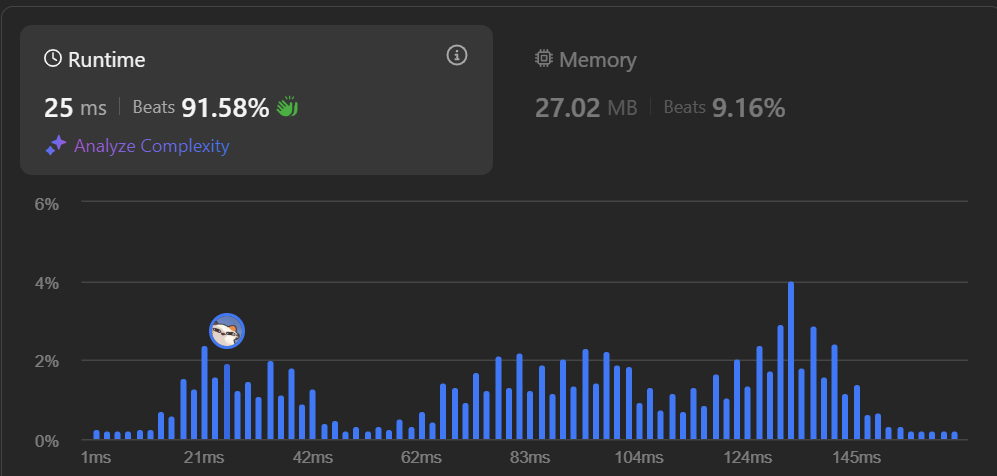
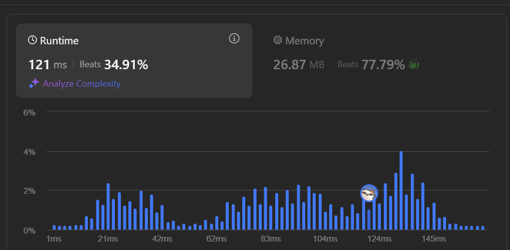

## Problem: Best Time to Buy and Sell Stock (LeetCode)  
[View problem on LeetCode](https://leetcode.com/problems/best-time-to-buy-and-sell-stock/description/)  

### A. Problem Statement 💁‍♀️  
You are given an array `prices` where `prices[i]` represents the stock price on the `i`th day.  

You want to maximize your profit by choosing a **single day to buy** and a **later day to sell**.  

Return the **maximum profit** you can achieve from this transaction. If no profit is possible, return `0`.  

### B. Problem Examples 😌  
#### ✨ Example 1:
**Input:** `prices = [7,1,5,3,6,4]`  
**Output:** `5`  
**Explanation:**  
- Buy on day `2` (price = `1`)  
- Sell on day `5` (price = `6`)  
- Profit = `6 - 1 = 5`  

#### ✨ Example 2:
**Input:** `prices = [7,6,4,3,1]`  
**Output:** `0`  
**Explanation:**  
No transactions are possible since stock prices only decrease.  

### C. Problem Constraints 🫡  
- `1 <= prices.length <= 10^5`  
- `0 <= prices[i] <= 10^4`  

### D. My Approach 😁  
To solve this problem efficiently, we need to track:  
1. **The lowest price seen so far** (`min_price`).  
2. **The maximum profit** if selling on the current day (`max_profit`).  

We can achieve this in a **single pass (O(n))**, updating `min_price` and `max_profit` dynamically.

### E. Brute Force Approach (O(n²)) 🚀  
A naive approach would be to check **all possible pairs (buy, sell)** using two nested loops:

```python
def maxProfit(prices):
    max_profit = 0
    for i in range(len(prices)):
        for j in range(i + 1, len(prices)):
            profit = prices[j] - prices[i]
            max_profit = max(max_profit, profit)
    return max_profit
```
✅ **Correct, but too slow!**  
❌ **Time Complexity: O(n²)** → Inefficient for large inputs (`10^5`).  

### F. Optimized Approach (O(n), Single Pass) 🏎️💨  
Instead of checking all pairs, we can track the **minimum price** and update `max_profit` in one loop.

#### **Optimized Code**
```python
def maxProfit(prices):
    min_price = float('inf')
    max_profit = 0
    
    for price in prices:
        if price < min_price:
            min_price = price  # Update lowest price seen so far
        if max_profit < (price - min_price):
            max_profit = price - min_price  # Update max profit
        
    return max_profit
```
✅ **Time Complexity:** `O(n)` → Only one loop.  
✅ **Space Complexity:** `O(1)` → Only two extra variables.  

### G. Example Walkthrough 📊  
For `prices = [7,1,5,3,6,4]`:

| Day | Price | Min Price | Profit Calculation | Max Profit |
|----|------|-----------|-----------------|------------|
| 1  | 7    | 7         | -               | 0          |
| 2  | 1    | 1         | -               | 0          |
| 3  | 5    | 1         | 5 - 1 = 4       | 4          |
| 4  | 3    | 1         | 3 - 1 = 2       | 4 (No change) |
| 5  | 6    | 1         | 6 - 1 = 5       | 5 (Update) |
| 6  | 4    | 1         | 4 - 1 = 3       | 5 (No change) |

✅ **Final Output: `5`**  


### H. Submission Details 🎯  

#### **Python Submission (If-Else Approach - Faster 🚀)**
  

#### **Python Submission (Min-Max Approach - Slower ❌)**
  

💡 **Why did runtime vary?**  
- **Python's function call overhead** (`min()`/`max()` is slightly slower).  
- **LeetCode’s execution environment is inconsistent**.  
- **If-else is slightly faster than `min()`/`max()` because of function call overhead**. 

### I. Final Thoughts ✨  
- **Brute-force (O(n²)) is too slow** for large inputs.  
- **Optimized approach (O(n)) is the best possible solution** 🚀.  
- **Using `if-else` is slightly faster than `min()`/`max()` in Python.**  