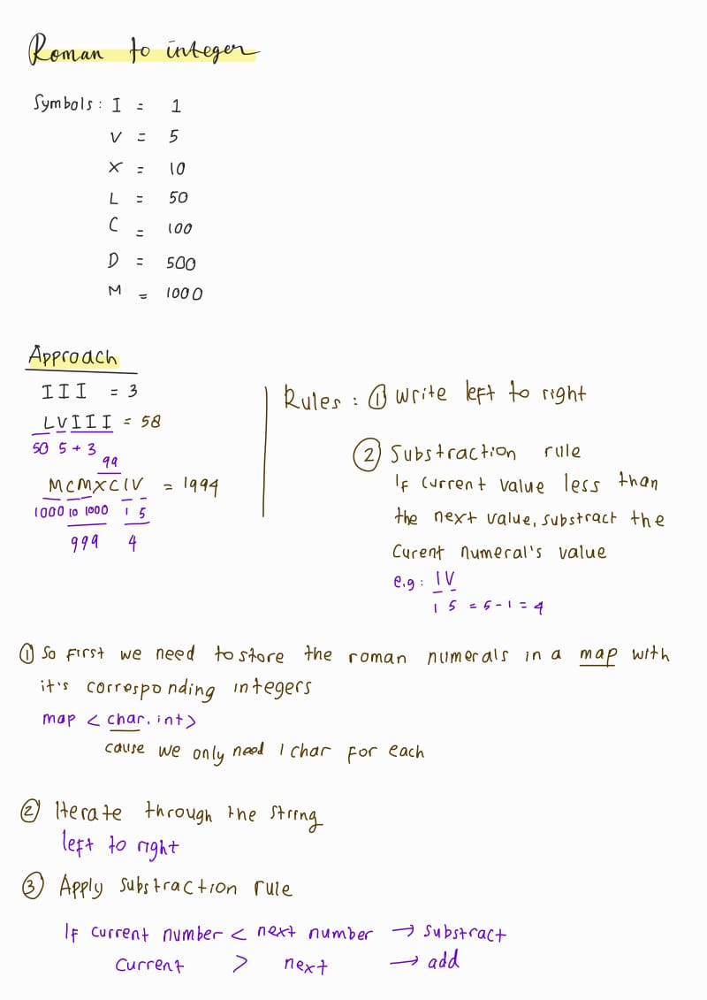
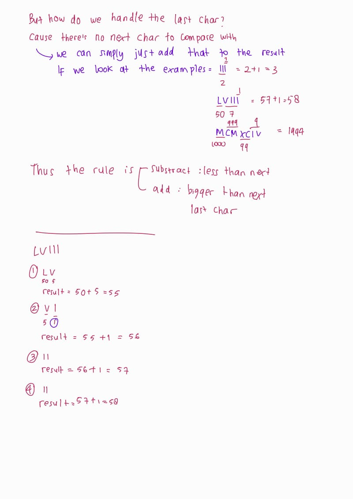

## Problem: Roman to Integer (LeetCode)

### A. Problem Statement 💁‍♀️
Roman numerals are represented by seven different symbols: I, V, X, L, C, D and M.

| Symbol | Value |
| ------ | ----- |
| I      | 1     |
| V      | 5     |
| X      | 10    |
| L      | 50    |
| C      | 100   |
| D      | 500   |
| M      | 1000  |

For example:
- `2` is written as `II` in Roman numerals, just two ones added together.
- `12` is written as `XII`, which is simply `X + II`.
- The number `27` is written as `XXVII`, which is `XX + V + II`.

Roman numerals are usually written largest to smallest from left to right. However, the numeral for four is not `IIII`. Instead, the number four is written as `IV`. Because the one is before the five, we subtract it making four. The same principle applies to the number nine, which is written as `IX`.

There are six instances where subtraction is used:

- `I` can be placed before `V` (5) and `X` (10) to make 4 and 9.
- `X` can be placed before `L` (50) and `C` (100) to make 40 and 90.
- `C` can be placed before `D` (500) and `M` (1000) to make 400 and 900.

Given a Roman numeral, convert it to an integer.

### B. Problem Examples 😌
#### ✨ Example 1:
Input: s = "III" <br/>
Output: 3 <br/>
Explanation: III = 3. <br/>

#### ✨ Example 2: <br/>
Input:   s = "LVIII" <br/>
Output: 58 <br/>
Explanation: L = 50, V= 5, III = 3. <br/>

#### ✨ Example 3: <br/>
Input:  s = "MCMXCIV"  <br/>
Output: 1994 <br/>
Explanation: M = 1000, CM = 900, XC = 90 and IV = 4. <br/>
 
### C. Problem Constraints 🫡

- 1 <= s.length <= 15 <br/>
- s contains only the characters ('I', 'V', 'X', 'L', 'C', 'D', 'M'). <br/>
- It is guaranteed that s is a valid roman numeral in the range [1, 3999]. <br/>
 

### D. My Approach 😁
 <br/>
 <br/>

For more detailed example,

> String: "MCMXCIV" <br />
Length (`n`) = 7

### Iteration Process:

1. **Iteration 1:**
   - `i = 1`
   - Current character: `s[i-1] = s[0] = 'M'`
   - Next character: `s[i] = s[1] = 'C'`
   - Compare: `romanInt['M'] = 1000` and `romanInt['C'] = 100`
   - Since `1000 > 100`, **Add** `1000` to `result`.
   - `result = 0 + 1000 = 1000`

2. **Iteration 2:**
   - `i = 2`
   - Current character: `s[i-1] = s[1] = 'C'`
   - Next character: `s[i] = s[2] = 'M'`
   - Compare: `romanInt['C'] = 100` and `romanInt['M'] = 1000`
   - Since `100 < 1000`, **Subtract** `100` from `result`.
   - `result = 1000 - 100 = 900`

3. **Iteration 3:**
   - `i = 3`
   - Current character: `s[i-1] = s[2] = 'M'`
   - Next character: `s[i] = s[3] = 'X'`
   - Compare: `romanInt['M'] = 1000` and `romanInt['X'] = 10`
   - Since `1000 > 10`, **Add** `1000` to `result`.
   - `result = 900 + 1000 = 1900`

4. **Iteration 4:**
   - `i = 4`
   - Current character: `s[i-1] = s[3] = 'X'`
   - Next character: `s[i] = s[4] = 'C'`
   - Compare: `romanInt['X'] = 10` and `romanInt['C'] = 100`
   - Since `10 < 100`, **Subtract** `10` from `result`.
   - `result = 1900 - 10 = 1890`

5. **Iteration 5:**
   - `i = 5`
   - Current character: `s[i-1] = s[4] = 'C'`
   - Next character: `s[i] = s[5] = 'I'`
   - Compare: `romanInt['C'] = 100` and `romanInt['I'] = 1`
   - Since `100 > 1`, **Add** `100` to `result`.
   - `result = 1890 + 100 = 1990`

6. **Iteration 6:**
   - `i = 6`
   - Current character: `s[i-1] = s[5] = 'I'`
   - Next character: `s[i] = s[6] = 'V'`
   - Compare: `romanInt['I'] = 1` and `romanInt['V'] = 5`
   - Since `1 < 5`, **Subtract** `1` from `result`.
   - `result = 1990 - 1 = 1989`

7. **Iteration 7:**
   - `i = 7`
   - Current character: `s[i-1] = s[6] = 'V'`
   - There is no next character because we are at the last character of the string.
   - Since it's the last character, **Add** `5` to `result`.
   - `result = 1989 + 5 = 1994`

The final value of `result` after all iterations is `1994`, which is the correct integer value for the Roman numeral "MCMXCIV".

#### Pseudocode

```c
FUNCTION romanToInt(s: STRING) -> INTEGER:
    CREATE a dictionary romanInt with mappings:
        'I' -> 1
        'V' -> 5
        'X' -> 10
        'L' -> 50
        'C' -> 100
        'D' -> 500
        'M' -> 1000
    
    INITIALIZE result to 0
    LET n be the length of string s
    
    FOR i from 1 to n (inclusive):
        IF i is less than n AND the value of s[i-1] in romanInt is less than the value of s[i] in romanInt:
            SUBTRACT the value of s[i-1] from result
        ELSE:
            ADD the value of s[i-1] to result
    
    RETURN result

```
## Submission details
Cpp submission <br />
 <br />

Python submission <br />
 <br />


