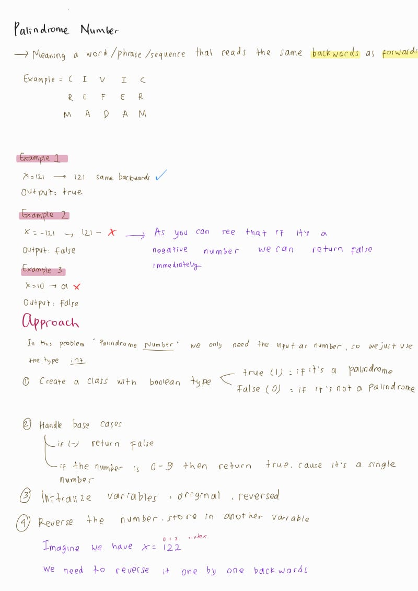
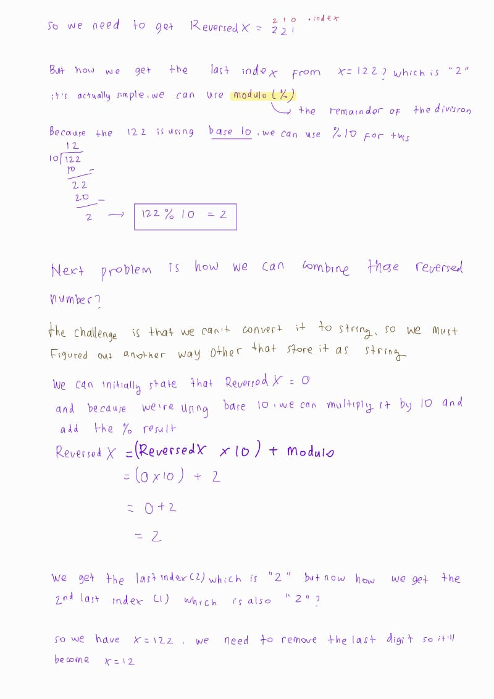
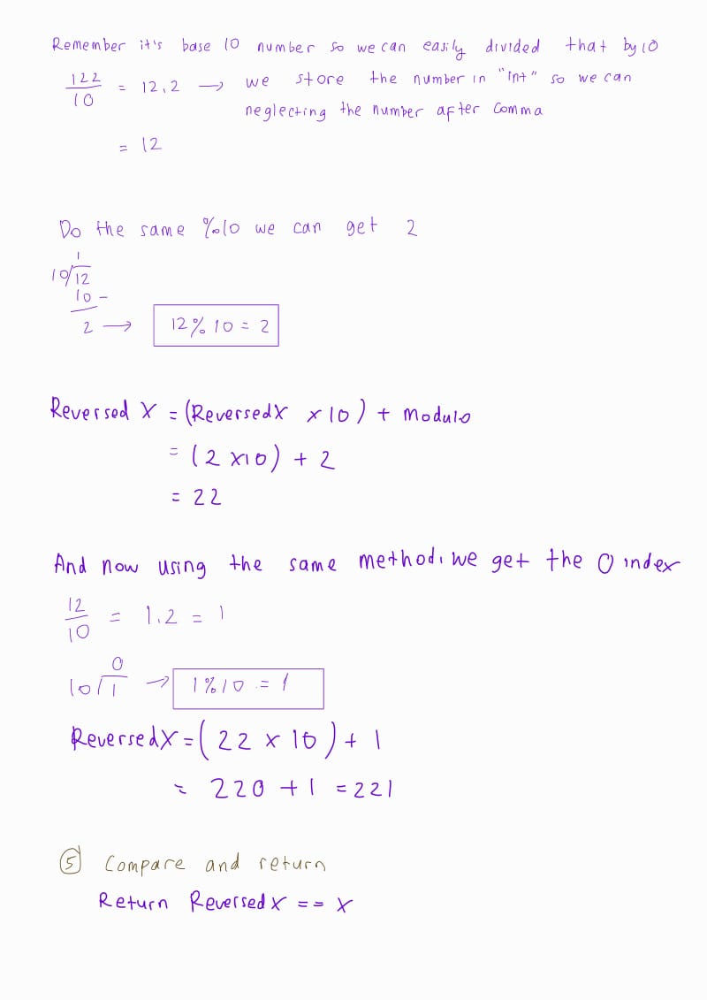

## Problem: Two Sum (LeetCode)

### A. Problem Statement 💁‍♀️
Given an integer x, return true if x is a palindrome, and false otherwise.

### B. Problem Examples 😌
#### ✨ Example 1:
Input: x = 121 <br/>
Output: true <br/>
Explanation: 121 reads as 121 from left to right and from right to left. <br/>

#### ✨ Example 2: <br/>
Input:  x = -121 <br/>
Output: false <br/>
Explanation: From left to right, it reads -121. From right to left, it becomes 121-. Therefore it is not a palindrome. <br/>

#### ✨ Example 3: <br/>
Input: x = 10  <br/>
Output: false <br/>
Explanation: Reads 01 from right to left. Therefore it is not a palindrome. <br/>
 
### C. Problem Constraints 🫡

-231 <= x <= 231 - 1 <br/>
 

Follow-up: Could you solve it without converting the integer to a string?

### D. My Approach 😁
 <br/>
 <br/>
 <br/>

Using this approach I managed to reversed the numbers without converting it into a string.

#### Pseudocode

```py
class Solution:
    method isPalindrome(x: integer) -> boolean:
        // Handle base cases
        if x < 0:
            return False
        if x is a single digit (x < 10):
            return True
        
        // Initialize variables
        original = x
        reversed_num = 0
        
        // Reverse the number
        while x > 0:
            digit = x % 10
            // Overflow check
            if reversed_num > (MAX_INT - digit) // 10:
                return False // Overflow would occur
            reversed_num = (reversed_num * 10) + digit
            x = x // 10
        
        // Compare original number with reversed number
        return original == reversed_num

```


